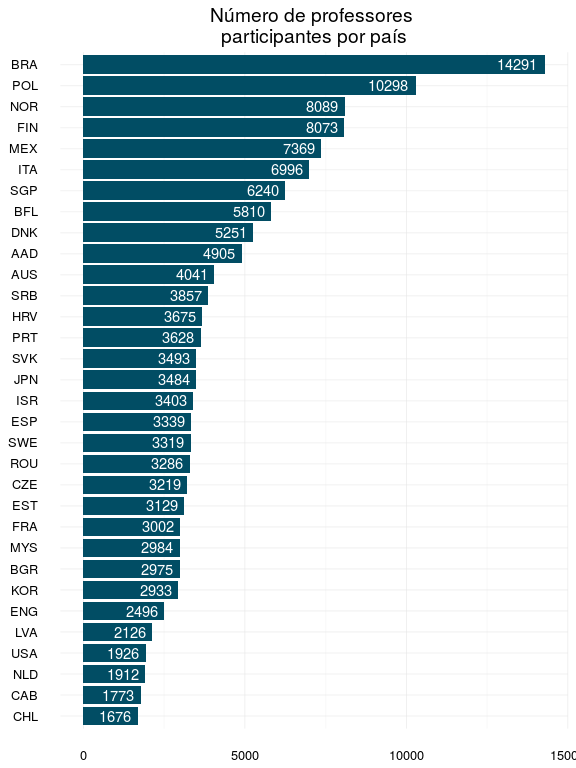

Primeiros passos em Talis 2013
================
André Rodrigues
2016-11-07

Primeiros passos
================

### Carregando bibliotecas

O primeiro passo é sempre carregar as bibliotecas que serão utilizadas ao longo do programa. Cada biblioteca é como uma caixa de ferramentas que deve nos ajudar em tarefas específicas como, por exemplo, *criar gráficos*, *manipular de dados*, etc. Geralmente, procuro descrever como comentário o que cada biblioteca ajuda a realizar.

``` r
library(tidyr) # organização das informações
library(dplyr) # cria sumário e manipula dados
library(ggplot2) # criação de gráficos
library(ggthemes) # temas e cores para gráficos
library(plotly) # gráficos interativos
library(descr) # tabelas cruzadas
library(knitr) # gera markdown
```

### Carregando dados

O segundo passo é carregar as informações. Os dados da pesquisa **TALIS 2013** estão em arquivos com *valores separados por vírgula* `.csv` \[Comma-separated values\]. Esse é atualmente o modo mais simples e versátil de guardar as informações, já que podem ser facilmente abertos em planilhas do *excel* ou softwares similares. Para abrir arquivos como esse utilizaremos a função `read.csv()`. Os dados estão separados em três arquivos, cada um identificado com a primeira letra representando os níveis de ensino:

> > **A:** fundamental I; **B:** começo do fundamental II; **C:** final do fundamental II.

Além disso, incluímos a variável `LEVEL` com as respectivas letras para que possamos manter a identificação ao unificarmos os dados.

``` r
# Carrega dados ref. a educação primária - arquivo iniciado com letra A
talis_atgintt2 <- read.csv("/home/andre/dados/talis/2013/ATGINTT2.csv")
talis_atgintt2$LEVEL <- "A"

# Carrega dados ref. ao ensino fundamental I - arquivo iniciado com letra B
talis_btgintt2 <- read.csv("/home/andre/dados/talis/2013/BTGINTT2.csv")
talis_btgintt2$LEVEL <- "B"

# Carrega dados ref. ao ensino fundamental I - arquivo iniciado com letra C
talis_ctgintt2 <- read.csv("/home/andre/dados/talis/2013/CTGINTT2.csv")
talis_ctgintt2$LEVEL <- "C"
```

Como as três planilhas (*data.farme*) têm o mesmo conjunto de variáveis/colunas podemos apenas emplilha-las utilizando a função `rbind()` que agrupa as linhas.

``` r
# Agrupa todos os dados em um único data frame talis13
talis13 <- rbind(talis_atgintt2,talis_btgintt2, talis_ctgintt2)
```

Com isso temos um conjunto de dados amplo e unificado. Com a função `dim()` conseguimos identificar o tamanhp do *data frame*. E com a função `str()` conseguimos saber a estrutura da informação que está disponível.

``` r
str(talis13)
```

    ## 'data.frame':    142998 obs. of  527 variables:
    ##  $ IDSCHOOL    : int  1001 1001 1001 1001 1001 1001 1001 1001 1001 1001 ...
    ##  $ IDTEACH     : int  100101 100103 100104 100105 100107 100108 100110 100112 100113 100114 ...
    ##  $ CNTRY       : Factor w/ 32 levels "BFL","DNK","FIN",..: 1 1 1 1 1 1 1 1 1 1 ...
    ##  $ IDCNTRY     : int  956 956 956 956 956 956 956 956 956 956 ...
    ##  $ IDCNTRYR    : int  33 33 33 33 33 33 33 33 33 33 ...
    ##  $ IDCNTPOP    : Factor w/ 47 levels "BFL1","DNK1",..: 1 1 1 1 1 1 1 1 1 1 ...
    ##  $ PISASCHOOLID: int  99998 99998 99998 99998 99998 99998 99998 99998 99998 99998 ...
    ##  $ TT2G01      : int  2 1 2 1 1 2 1 1 1 1 ...
    ##  $ TT2G02      : int  35 48 36 45 52 28 42 26 35 29 ...
    ##  $ TT2G03      : int  1 1 1 1 1 1 1 1 3 1 ...
    ##  $ TT2G04      : int  6 6 6 6 6 6 6 6 1 6 ...
    ##  $ TT2G05A     : int  12 1 11 23 26 1 19 4 12 8 ...
    ##  $ TT2G05B     : int  12 21 11 24 29 4 22 4 12 8 ...
    ##  $ TT2G05C     : int  0 0 0 0 3 2 0 0 0 0 ...
    ##  $ TT2G05D     : int  0 7 2 0 99 0 0 0 0 0 ...
    ##  $ TT2G06      : int  1 1 1 1 1 3 1 1 1 1 ...
    ##  $ TT2G07      : int  2 2 2 2 2 2 2 2 2 2 ...
    ##  $ TT2G08      : int  96 96 96 96 96 96 96 96 96 96 ...
    ##  $ TT2G09      : int  2 3 2 3 2 1 2 2 2 2 ...
    ##  $ TT2G10      : int  2 2 2 3 2 2 2 2 2 2 ...
    ##  $ TT2G11      : int  1 1 1 1 1 1 1 1 1 1 ...
    ##  $ TT2G12A     : int  1 1 1 1 1 2 1 1 1 1 ...
    ##  $ TT2G12B     : int  1 1 1 1 1 2 1 1 1 1 ...
    ##  $ TT2G12C     : int  1 1 1 1 2 2 1 1 1 1 ...
    ##  $ TT2G13A     : int  3 3 4 3 4 2 3 3 4 3 ...
    ##  $ TT2G13B     : int  3 2 4 3 4 3 3 3 3 3 ...
    ##  $ TT2G13C     : int  3 2 4 3 3 3 3 3 4 2 ...
    ##  $ TT2G14A1    : int  1 1 2 1 1 1 1 1 1 1 ...
    ##  $ TT2G14A2    : int  2 2 2 2 2 2 2 2 2 2 ...
    ##  $ TT2G14A3    : int  8 8 8 8 8 8 8 8 8 8 ...
    ##  $ TT2G14A4    : int  2 2 2 2 2 2 2 2 2 2 ...
    ##  $ TT2G14B1    : int  1 1 2 1 1 1 1 1 1 1 ...
    ##  $ TT2G14B2    : int  2 2 2 2 2 2 2 2 2 2 ...
    ##  $ TT2G14B3    : int  8 8 8 8 8 8 8 8 8 8 ...
    ##  $ TT2G14B4    : int  2 2 2 2 2 2 2 2 2 2 ...
    ##  $ TT2G14C1    : int  1 1 2 1 1 1 1 2 1 1 ...
    ##  $ TT2G14C2    : int  2 2 2 2 2 2 2 2 2 2 ...
    ##  $ TT2G14C3    : int  8 8 8 8 8 8 8 8 8 8 ...
    ##  $ TT2G14C4    : int  2 2 2 2 2 2 2 1 2 2 ...
    ##  $ TT2G14D1    : int  1 1 2 2 1 2 1 1 1 1 ...
    ##  $ TT2G14D2    : int  2 2 2 2 2 2 2 2 2 2 ...
    ##  $ TT2G14D3    : int  8 8 8 8 8 8 8 8 8 8 ...
    ##  $ TT2G14D4    : int  2 2 2 2 2 2 2 1 2 2 ...
    ##  $ TT2G14E1    : int  1 1 2 1 1 2 1 1 1 2 ...
    ##  $ TT2G14E2    : int  2 2 2 2 2 2 2 2 2 2 ...
    ##  $ TT2G14E3    : int  8 8 8 8 8 8 8 8 8 8 ...
    ##  $ TT2G14E4    : int  2 2 2 2 2 2 2 1 2 2 ...
    ##  $ TT2G14F1    : int  1 2 2 2 2 2 2 2 2 2 ...
    ##  $ TT2G14F2    : int  2 2 2 2 2 2 2 2 2 2 ...
    ##  $ TT2G14F3    : int  8 8 8 8 8 8 8 8 8 8 ...
    ##  $ TT2G14F4    : int  2 2 2 2 2 2 2 2 2 2 ...
    ##  $ TT2G14G1    : int  1 2 2 2 2 1 1 1 1 2 ...
    ##  $ TT2G14G2    : int  2 2 2 2 2 2 2 2 2 2 ...
    ##  $ TT2G14G3    : int  8 8 8 8 8 8 8 8 8 8 ...
    ##  $ TT2G14G4    : int  2 2 2 2 2 2 1 1 2 2 ...
    ##  $ TT2G14H1    : int  1 1 2 2 1 1 1 1 1 1 ...
    ##  $ TT2G14H2    : int  2 2 2 2 2 2 2 2 2 2 ...
    ##  $ TT2G14H3    : int  8 8 8 8 8 8 8 8 8 8 ...
    ##  $ TT2G14H4    : int  2 2 2 2 2 2 2 2 2 2 ...
    ##  $ TT2G14I1    : int  1 1 1 1 1 1 1 1 1 1 ...
    ##  $ TT2G14I2    : int  2 2 2 2 2 2 2 2 2 2 ...
    ##  $ TT2G14I3    : int  8 8 8 8 8 8 8 8 8 8 ...
    ##  $ TT2G14I4    : int  2 2 2 2 2 2 2 2 2 2 ...
    ##  $ TT2G14J1    : int  1 1 1 2 1 1 1 1 1 1 ...
    ##  $ TT2G14J2    : int  2 2 2 2 2 2 2 2 2 2 ...
    ##  $ TT2G14J3    : int  8 8 8 8 8 8 8 8 8 8 ...
    ##  $ TT2G14J4    : int  2 2 2 2 2 2 2 2 2 2 ...
    ##  $ TT2G14K1    : int  2 1 2 2 1 2 2 2 1 1 ...
    ##  $ TT2G14K2    : int  2 2 2 2 2 2 2 2 2 2 ...
    ##  $ TT2G14K3    : int  8 8 8 8 8 8 8 8 8 8 ...
    ##  $ TT2G14K4    : int  2 2 2 2 2 2 2 2 2 2 ...
    ##  $ TT2G14L1    : int  1 1 2 1 1 1 1 1 1 1 ...
    ##  $ TT2G14L2    : int  2 2 2 2 2 2 2 2 2 2 ...
    ##  $ TT2G14L3    : int  8 8 8 8 8 8 8 8 8 8 ...
    ##  $ TT2G14L4    : int  2 2 2 2 2 2 2 1 2 2 ...
    ##  $ TT2G14M1    : int  2 2 2 2 2 2 2 2 2 2 ...
    ##  $ TT2G14M2    : int  2 2 2 2 2 2 2 2 2 2 ...
    ##  $ TT2G14M3    : int  8 8 8 8 8 8 8 8 8 8 ...
    ##  $ TT2G14M4    : int  2 2 2 2 2 2 2 2 2 2 ...
    ##  $ TT2G14MT    : Factor w/ 8307 levels " ","0","1/2 \xe5r skolebibliotekkunnskap",..: 1 1 1 1 1 1 1 1 1 1 ...
    ##  $ TT2G15A     : int  1 1 2 1 1 2 1 1 1 1 ...
    ##  $ TT2G15B     : int  1 1 2 1 1 2 1 1 1 1 ...
    ##  $ TT2G15C     : int  8 8 8 8 8 8 8 8 8 8 ...
    ##  $ TT2G15D     : int  8 8 8 8 8 8 8 8 8 8 ...
    ##  $ TT2G15E     : int  2 1 2 1 1 2 1 1 2 2 ...
    ##  $ TT2G15F     : int  8 8 8 8 8 8 8 8 8 8 ...
    ##  $ TT2G15G     : int  8 8 8 8 8 8 8 8 8 8 ...
    ##  $ TT2G15H     : int  1 1 2 1 1 2 1 1 1 1 ...
    ##  $ TT2G15I     : int  2 2 1 2 2 2 2 2 1 2 ...
    ##  $ TT2G15J     : int  2 2 2 2 2 1 2 2 2 2 ...
    ##  $ TT2G15K     : int  8 8 8 8 8 8 8 8 8 8 ...
    ##  $ TT2G15L     : int  1 2 2 1 1 2 2 2 1 2 ...
    ##  $ TT2G16      : int  45 36 14 40 40 32 32 43 20 56 ...
    ##  $ TT2G17      : int  24 26 13 24 24 27 20 24 12 24 ...
    ##  $ TT2G18A     : int  6 1 1 8 8 3 2 12 2 4 ...
    ##  $ TT2G18B     : int  3 4 3 5 4 2 2 2 2 1 ...
    ##  $ TT2G18C     : int  2 2 0 2 6 0 7 3 1 1 ...
    ##  $ TT2G18D     : int  2 1 0 1 2 0 0 0 1 0 ...
    ##  $ TT2G18E     : int  1 0 0 1 2 0 0 0 999 0 ...
    ##   [list output truncated]

Com a função `head()` podemos imprimir na tela as primeiras linhas do nosso *data frame*. Com a função `tail()` podemos imprimir na tela as últimas linhas do nosso *data frame*.

``` r
head(talis13)
```

    ##   IDSCHOOL IDTEACH CNTRY IDCNTRY IDCNTRYR IDCNTPOP PISASCHOOLID TT2G01
    ## 1     1001  100101   BFL     956       33     BFL1        99998      2
    ## 2     1001  100103   BFL     956       33     BFL1        99998      1
    ## 3     1001  100104   BFL     956       33     BFL1        99998      2
    ## 4     1001  100105   BFL     956       33     BFL1        99998      1
    ## 5     1001  100107   BFL     956       33     BFL1        99998      1
    ## 6     1001  100108   BFL     956       33     BFL1        99998      2
    ##   TT2G02 TT2G03 TT2G04 TT2G05A TT2G05B TT2G05C TT2G05D TT2G06 TT2G07
    ## 1     35      1      6      12      12       0       0      1      2
    ## 2     48      1      6       1      21       0       7      1      2
    ## 3     36      1      6      11      11       0       2      1      2
    ## 4     45      1      6      23      24       0       0      1      2
    ## 5     52      1      6      26      29       3      99      1      2
    ## 6     28      1      6       1       4       2       0      3      2
    ##   TT2G08 TT2G09 TT2G10 TT2G11 TT2G12A TT2G12B TT2G12C TT2G13A TT2G13B
    ## 1     96      2      2      1       1       1       1       3       3
    ## 2     96      3      2      1       1       1       1       3       2
    ## 3     96      2      2      1       1       1       1       4       4
    ## 4     96      3      3      1       1       1       1       3       3
    ## 5     96      2      2      1       1       1       2       4       4
    ## 6     96      1      2      1       2       2       2       2       3
    ##   TT2G13C TT2G14A1 TT2G14A2 TT2G14A3 TT2G14A4 TT2G14B1 TT2G14B2 TT2G14B3
    ## 1       3        1        2        8        2        1        2        8
    ## 2       2        1        2        8        2        1        2        8
    ## 3       4        2        2        8        2        2        2        8
    ## 4       3        1        2        8        2        1        2        8
    ## 5       3        1        2        8        2        1        2        8
    ## 6       3        1        2        8        2        1        2        8
    ##   TT2G14B4 TT2G14C1 TT2G14C2 TT2G14C3 TT2G14C4 TT2G14D1 TT2G14D2 TT2G14D3
    ## 1        2        1        2        8        2        1        2        8
    ## 2        2        1        2        8        2        1        2        8
    ## 3        2        2        2        8        2        2        2        8
    ## 4        2        1        2        8        2        2        2        8
    ## 5        2        1        2        8        2        1        2        8
    ## 6        2        1        2        8        2        2        2        8
    ##   TT2G14D4 TT2G14E1 TT2G14E2 TT2G14E3 TT2G14E4 TT2G14F1 TT2G14F2 TT2G14F3
    ## 1        2        1        2        8        2        1        2        8
    ## 2        2        1        2        8        2        2        2        8
    ## 3        2        2        2        8        2        2        2        8
    ## 4        2        1        2        8        2        2        2        8
    ## 5        2        1        2        8        2        2        2        8
    ## 6        2        2        2        8        2        2        2        8
    ##   TT2G14F4 TT2G14G1 TT2G14G2 TT2G14G3 TT2G14G4 TT2G14H1 TT2G14H2 TT2G14H3
    ## 1        2        1        2        8        2        1        2        8
    ## 2        2        2        2        8        2        1        2        8
    ## 3        2        2        2        8        2        2        2        8
    ## 4        2        2        2        8        2        2        2        8
    ## 5        2        2        2        8        2        1        2        8
    ## 6        2        1        2        8        2        1        2        8
    ##   TT2G14H4 TT2G14I1 TT2G14I2 TT2G14I3 TT2G14I4 TT2G14J1 TT2G14J2 TT2G14J3
    ## 1        2        1        2        8        2        1        2        8
    ## 2        2        1        2        8        2        1        2        8
    ## 3        2        1        2        8        2        1        2        8
    ## 4        2        1        2        8        2        2        2        8
    ## 5        2        1        2        8        2        1        2        8
    ## 6        2        1        2        8        2        1        2        8
    ##   TT2G14J4 TT2G14K1 TT2G14K2 TT2G14K3 TT2G14K4 TT2G14L1 TT2G14L2 TT2G14L3
    ## 1        2        2        2        8        2        1        2        8
    ## 2        2        1        2        8        2        1        2        8
    ## 3        2        2        2        8        2        2        2        8
    ## 4        2        2        2        8        2        1        2        8
    ## 5        2        1        2        8        2        1        2        8
    ## 6        2        2        2        8        2        1        2        8
    ##   TT2G14L4 TT2G14M1 TT2G14M2 TT2G14M3 TT2G14M4 TT2G14MT TT2G15A TT2G15B
    ## 1        2        2        2        8        2                1       1
    ## 2        2        2        2        8        2                1       1
    ## 3        2        2        2        8        2                2       2
    ## 4        2        2        2        8        2                1       1
    ## 5        2        2        2        8        2                1       1
    ## 6        2        2        2        8        2                2       2
    ##   TT2G15C TT2G15D TT2G15E TT2G15F TT2G15G TT2G15H TT2G15I TT2G15J TT2G15K
    ## 1       8       8       2       8       8       1       2       2       8
    ## 2       8       8       1       8       8       1       2       2       8
    ## 3       8       8       2       8       8       2       1       2       8
    ## 4       8       8       1       8       8       1       2       2       8
    ## 5       8       8       1       8       8       1       2       2       8
    ## 6       8       8       2       8       8       2       2       1       8
    ##   TT2G15L TT2G16 TT2G17 TT2G18A TT2G18B TT2G18C TT2G18D TT2G18E TT2G18F
    ## 1       1     45     24       6       3       2       2       1       5
    ## 2       2     36     26       1       4       2       1       0       1
    ## 3       2     14     13       1       3       0       0       0       1
    ## 4       1     40     24       8       5       2       1       1       5
    ## 5       1     40     24       8       4       6       2       2       4
    ## 6       2     32     27       3       2       0       0       0       1
    ##   TT2G18G TT2G18H TT2G18I TT2G19A TT2G19B TT2G19C TT2G20A TT2G20B TT2G21A1
    ## 1       3       0       0       2       2       2       2       2        1
    ## 2       0       0       1       2       2       2       2       2        1
    ## 3       0       1       0       2       1       2       2       2        1
    ## 4       2       0       5       2       1       1       2       2        1
    ## 5       2       1     999       2       1       2       2       2        2
    ## 6       0       0       0       2       2       2       2       2        1
    ##   TT2G21A2 TT2G21B1 TT2G21B2 TT2G21C1 TT2G21C2 TT2G21D1 TT2G21D2 TT2G21E1
    ## 1        3        1        4        1        1        2      996        2
    ## 2        3        2      996        2      996        2      996        2
    ## 3        1        2      996        2      996        2      996        2
    ## 4        3        2      996        2      996        2      996        2
    ## 5      996        2      996        2      996        2      996        2
    ## 6       10        2      996        2      996        2      996        2
    ##   TT2G21E2 TT2G21F TT2G21G TT2G21H TT2G21I TT2G22A1 TT2G22A2 TT2G22B1
    ## 1      996       2       2       2       2        1        2        2
    ## 2      996       2       2       2       2        1        2        2
    ## 3      996       2       1       2       2        1        3        2
    ## 4      996       2       1       1       1        1        4        1
    ## 5      996       2       1       1       2        1        2        1
    ## 6      996       1       1       2       2        1        3        1
    ##   TT2G22B2 TT2G22C1 TT2G22C2 TT2G22D1 TT2G22D2 TT2G22E1 TT2G22E2 TT2G22F1
    ## 1        6        1        2        2        6        1        3        2
    ## 2        6        2        6        2        6        2        6        1
    ## 3        6        2        6        2        6        2        6        2
    ## 4        4        1        4        2        6        1        3        1
    ## 5        2        2        6        2        6        2        6        1
    ## 6        3        1        9        2        6        2        6        2
    ##   TT2G22F2 TT2G22G1 TT2G22G2 TT2G22H1 TT2G22H2 TT2G22I1 TT2G22I2 TT2G22J1
    ## 1        6        2        6        2        6        2        6        2
    ## 2        2        2        6        2        6        2        6        1
    ## 3        6        2        6        2        6        2        6        2
    ## 4        4        2        6        2        6        2        6        2
    ## 5        2        2        6        2        6        2        6        2
    ## 6        6        2        6        2        6        2        6        2
    ##   TT2G22J2 TT2G22K1 TT2G22K2 TT2G22L1 TT2G22L2 TT2G22M1 TT2G22M2 TT2G22N1
    ## 1        6        2        6        8        8        8        8        2
    ## 2        3        2        6        8        8        8        8        2
    ## 3        6        2        6        8        8        8        8        2
    ## 4        6        2        6        8        8        8        8        2
    ## 5        6        1        2        8        8        8        8        2
    ## 6        6        2        6        8        8        8        8        2
    ##   TT2G22N2 TT2G23 TT2G24A TT2G24B TT2G24C TT2G25A TT2G25B TT2G25C TT2G25D
    ## 1        6      1       1       2       2       3       3       2       2
    ## 2        6      1       1       2       2       2       2       2       1
    ## 3        6      1       1       2       2       4       4       1       1
    ## 4        6      1       1       2       2       4       4       4       1
    ## 5        6      1       2       2       2       2       2       2       2
    ## 6        6      3       2       2       2       2       2       2       1
    ##   TT2G26A TT2G26B TT2G26C TT2G26D TT2G26E TT2G26F TT2G26G TT2G26H TT2G26I
    ## 1       1       1       1       2       3       1       1       2       2
    ## 2       2       2       1       3       3       3       2       2       3
    ## 3       2       2       2       4       1       2       2       3       3
    ## 4       1       1       1       1       4       3       1       1       4
    ## 5       1       1       1       1       4       2       2       2       3
    ## 6       9       9       9       9       9       9       9       9       9
    ##   TT2G26J TT2G26K TT2G26L TT2G26M TT2G26N TT2G27A TT2G27B TT2G27C TT2G27D
    ## 1       1       1       8       8       1       1       1       1       1
    ## 2       3       2       8       8       2       1       1       1       1
    ## 3       3       1       8       8       3       2       3       2       3
    ## 4       1       2       8       8       1       1       1       1       1
    ## 5       1       2       8       8       1       4       2       3       3
    ## 6       9       9       8       8       9       2       3       2       3
    ##   TT2G27E TT2G27F TT2G27G TT2G28A1 TT2G28A2 TT2G28A3 TT2G28A4 TT2G28A5
    ## 1       1       2       1        2        1        2        2        2
    ## 2       1       3       2        2        2        2        2        2
    ## 3       3       3       3        1        1        2        2        2
    ## 4       1       1       1        1        2        2        2        2
    ## 5       2       2       3        2        2        2        2        1
    ## 6       3       2       2        9        9        9        9        9
    ##   TT2G28A6 TT2G28B1 TT2G28B2 TT2G28B3 TT2G28B4 TT2G28B5 TT2G28B6 TT2G28C1
    ## 1        2        2        2        2        2        2        1        2
    ## 2        1        2        2        2        2        2        1        2
    ## 3        2        2        2        2        2        2        1        2
    ## 4        2        2        2        2        2        2        1        2
    ## 5        2        2        2        2        2        2        1        2
    ## 6        9        9        9        9        9        9        9        9
    ##   TT2G28C2 TT2G28C3 TT2G28C4 TT2G28C5 TT2G28C6 TT2G28D1 TT2G28D2 TT2G28D3
    ## 1        2        2        2        2        1        2        2        1
    ## 2        2        2        2        2        1        2        2        2
    ## 3        2        2        2        2        1        2        2        2
    ## 4        2        2        2        2        1        2        2        1
    ## 5        2        2        2        2        1        2        2        2
    ## 6        9        9        9        9        9        9        9        9
    ##   TT2G28D4 TT2G28D5 TT2G28D6 TT2G28E1 TT2G28E2 TT2G28E3 TT2G28E4 TT2G28E5
    ## 1        2        2        2        2        1        2        2        2
    ## 2        2        2        1        2        2        2        2        2
    ## 3        2        2        1        2        2        2        2        2
    ## 4        2        2        2        2        2        2        2        2
    ## 5        2        2        1        2        2        2        2        2
    ## 6        9        9        9        9        9        9        9        9
    ##   TT2G28E6 TT2G28F1 TT2G28F2 TT2G28F3 TT2G28F4 TT2G28F5 TT2G28F6 TT2G29A
    ## 1        2        2        2        1        2        2        2       3
    ## 2        1        2        2        2        2        2        1       6
    ## 3        1        2        2        2        2        2        1       4
    ## 4        1        2        2        2        2        2        1       4
    ## 5        1        2        2        2        2        2        1       4
    ## 6        9        9        9        9        9        9        9       9
    ##   TT2G29B TT2G29C TT2G29D TT2G29E TT2G29F TT2G29G TT2G29H TT2G29I TT2G29J
    ## 1       1       3       1       1       2       1       1       2       1
    ## 2       6       6       6       6       6       6       6       6       6
    ## 3       2       2       4       1       1       1       2       1       2
    ## 4       4       3       3       3       4       4       2       1       1
    ## 5       4       9       9       9       9       9       9       9       9
    ## 6       9       9       9       9       9       9       9       9       9
    ##   TT2G29K TT2G30A TT2G30B TT2G30C TT2G30D TT2G30E TT2G30F TT2G30G TT2G30H
    ## 1       3       1       3       1       2       2       1       1       1
    ## 2       6       6       6       6       6       6       6       6       6
    ## 3       2       2       1       2       1       2       2       1       1
    ## 4       4       4       4       1       2       2       4       1       3
    ## 5       9       3       3       1       3       3       3       3       3
    ## 6       9       9       9       9       9       9       9       9       9
    ##   TT2G30I TT2G30J TT2G30K TT2G30L TT2G30M TT2G30N TT2G31A TT2G31B TT2G31C
    ## 1       2       2       2       2       1       1       2       2       2
    ## 2       6       6       6       6       6       6       2       2       2
    ## 3       1       1       1       1       1       1       2       3       3
    ## 4       4       4       4       4       4       4       1       1       1
    ## 5       3       3       3       3       3       3       2       9       9
    ## 6       9       9       9       9       9       9       9       9       9
    ##   TT2G31D TT2G31E TT2G31F TT2G31G TT2G31H TT2G32A TT2G32B TT2G32C TT2G32D
    ## 1       1       1       4       3       2       4       3       3       4
    ## 2       3       3       3       3       3       3       3       3       3
    ## 3       2       2       2       2       2       4       4       4       4
    ## 4       3       1       1       4       3       4       3       4       3
    ## 5       2       2       2       9       9       4       3       3       4
    ## 6       9       9       9       9       9       4       3       3       2
    ##   TT2G33A TT2G33B TT2G33C TT2G33D TT2G33E TT2G33F TT2G33G TT2G33H TT2G34A
    ## 1       6       1       5       6       5       2       6       3       3
    ## 2       6       5       5       5       6       5       6       5       3
    ## 3       1       1       2       6       2       2       4       3       3
    ## 4       5       1       3       6       5       6       5       3       4
    ## 5       6       5       4       5       5       5       5       3       4
    ## 6       1       1       3       2       1       5       4       2       9
    ##   TT2G34B TT2G34C TT2G34D TT2G34E TT2G34F TT2G34G TT2G34H TT2G34I TT2G34J
    ## 1       3       3       3       3       3       2       4       4       2
    ## 2       3       3       3       3       3       3       3       3       3
    ## 3       3       2       3       3       3       3       3       3       3
    ## 4       4       4       3       3       4       4       4       3       4
    ## 5       4       4       4       4       4       4       4       4       4
    ## 6       7       7       7       7       7       7       7       7       7
    ##   TT2G34K TT2G34L TT2G35A TT2G35B TT2G35C TT2G35D TT2G35E TT2G35F TT2G36
    ## 1       4       2       5       2       3       2       4       1      2
    ## 2       3       3       5       5       5       3       5       1      1
    ## 3       3       3       5       5       3       3       5       1      2
    ## 4       4       3       5       4       4       2       4       1      1
    ## 5       4       4       5       2       2       1       2       3      2
    ## 6       7       7       7       7       7       7       7       7      7
    ##   TT2G37 TT2G38 TT2G39A TT2G39B TT2G39C TT2G40 TT2G41A TT2G41B TT2G41C
    ## 1     99     19      10       5      85      1       2       3       2
    ## 2     96    996     996     996     996      6       6       6       6
    ## 3      9     20       0      15      85      2       2       2       3
    ## 4     96    996     996     996     996      6       6       6       6
    ## 5      1     16      20      10      70      1       1       3       1
    ## 6     97    997     997     997     997      7       7       7       7
    ##   TT2G41D TT2G42A TT2G42B TT2G42C TT2G42D TT2G42E TT2G42F TT2G42G TT2G42H
    ## 1       2       3       2       3       2       2       4       3       2
    ## 2       6       6       6       6       6       6       6       6       6
    ## 3       3       3       2       1       3       3       1       1       1
    ## 4       6       6       6       6       6       6       6       6       6
    ## 5       2       3       3       4       4       4       4       3       3
    ## 6       7       7       7       7       7       7       7       7       7
    ##   TT2G43A TT2G43B TT2G43C TT2G43D TT2G43E TT2G43F TT2G44A TT2G44B TT2G44C
    ## 1       2       2       2       1       3       3       3       4       3
    ## 2       6       6       6       6       6       6       3       3       3
    ## 3       3       1       1       2       2       3       3       3       3
    ## 4       6       6       6       6       6       6       3       3       3
    ## 5       4       2       3       3       3       4       3       3       3
    ## 6       7       7       7       7       7       7       7       7       7
    ##   TT2G44D TT2G44E TT2G45A TT2G45B TT2G45C TT2G45D TT2G46A TT2G46B TT2G46C
    ## 1       3       3       4       3       4       4       4       4       2
    ## 2       3       3       3       4       4       3       3       3       2
    ## 3       3       3       3       3       3       4       3       3       2
    ## 4       3       4       4       4       4       4       2       4       1
    ## 5       3       3       3       4       3       3       3       2       2
    ## 6       7       7       7       7       7       7       7       7       7
    ##   TT2G46D TT2G46E TT2G46F TT2G46G TT2G46H TT2G46I TT2G46J TT2G48A TT2G48B
    ## 1       1       4       1       4       3       3       4       1       6
    ## 2       2       3       2       3       2       3       3       1       6
    ## 3       2       3       3       3       2       3       3       2       1
    ## 4       1       4       2       4       2       3       4       1       6
    ## 5       2       3       9       3       2       3       3       2       2
    ## 6       7       7       7       7       7       7       7       7       7
    ##   TT2G48C TT2G48D TT2G48E TT2G48F TT2G49A TT2G49B TT2G49C TT2G49D TT2G49E
    ## 1       6       6       6       6       6       6       6       6       6
    ## 2       6       6       6       6       6       6       6       6       6
    ## 3       2       2       2       2       1       2       2       2       2
    ## 4       6       6       6       6       6       6       6       6       6
    ## 5       2       2       1       1       2       2       2       2       2
    ## 6       7       7       7       7       7       7       7       7       7
    ##   TT2G49F TT2G49G TT2M01T TT2M02T TT2M03 TT2M04 TT2M05 TT2M06 TT2M07A
    ## 1       6       6      NA      NA      8      8     98    998       8
    ## 2       6       6      NA      NA      8      8     98    998       8
    ## 3       2       2      NA      NA      8      8     98    998       8
    ## 4       6       6      NA      NA      8      8     98    998       8
    ## 5       2       1      NA      NA      8      8     98    998       8
    ## 6       7       7      NA      NA      8      8     98    998       8
    ##   TT2M07B TT2M07C TT2M07D TT2M07E TT2M07F TT2M07G TT2M08 TT2M09 TT2M10
    ## 1       8       8       8       8       8       8      8      8      8
    ## 2       8       8       8       8       8       8      8      8      8
    ## 3       8       8       8       8       8       8      8      8      8
    ## 4       8       8       8       8       8       8      8      8      8
    ## 5       8       8       8       8       8       8      8      8      8
    ## 6       8       8       8       8       8       8      8      8      8
    ##   TT2M11 TT2M12A TT2M12B TT2M12C TT2M12D TT2M12E TT2M13A TT2M13B TT2M13C
    ## 1      8       8       8       8       8       8       8       8       8
    ## 2      8       8       8       8       8       8       8       8       8
    ## 3      8       8       8       8       8       8       8       8       8
    ## 4      8       8       8       8       8       8       8       8       8
    ## 5      8       8       8       8       8       8       8       8       8
    ## 6      8       8       8       8       8       8       8       8       8
    ##   TT2M13D TT2M13E TT2M13F TT2M13G TT2M13H TT2M13I TT2M13J TT2M14A TT2M14B
    ## 1       8       8       8       8       8       8       8       8       8
    ## 2       8       8       8       8       8       8       8       8       8
    ## 3       8       8       8       8       8       8       8       8       8
    ## 4       8       8       8       8       8       8       8       8       8
    ## 5       8       8       8       8       8       8       8       8       8
    ## 6       8       8       8       8       8       8       8       8       8
    ##   TT2M14C TT2M14D TT2M14E TT2M14F TT2M14G TT2M14H TT2M14I TT2M14J TT2M14K
    ## 1       8       8       8       8       8       8       8       8       8
    ## 2       8       8       8       8       8       8       8       8       8
    ## 3       8       8       8       8       8       8       8       8       8
    ## 4       8       8       8       8       8       8       8       8       8
    ## 5       8       8       8       8       8       8       8       8       8
    ## 6       8       8       8       8       8       8       8       8       8
    ##   TT2M14L TT2M15A TT2M15B TT2M15C TT2M15D TT2M15E TT2M15F TT2M16A TT2M16B
    ## 1       8       8       8       8       8       8       8       8       8
    ## 2       8       8       8       8       8       8       8       8       8
    ## 3       8       8       8       8       8       8       8       8       8
    ## 4       8       8       8       8       8       8       8       8       8
    ## 5       8       8       8       8       8       8       8       8       8
    ## 6       8       8       8       8       8       8       8       8       8
    ##   TT2M16C TT2M16D TT2M16E TT2M16F TT2M16G TT2M17A TT2M17B TT2M17C
    ## 1       8       8       8       8       8       8       8       8
    ## 2       8       8       8       8       8       8       8       8
    ## 3       8       8       8       8       8       8       8       8
    ## 4       8       8       8       8       8       8       8       8
    ## 5       8       8       8       8       8       8       8       8
    ## 6       8       8       8       8       8       8       8       8
    ##       SECLSS     SEINSS     SEENGS   TSELEFFS    TJSENVS    TJSPROS
    ## 1   13.71899   11.25709   11.43418   12.13675   14.96791   14.79599
    ## 2   11.88425   11.44953   11.55504   11.62960   11.56279   11.54898
    ## 3   11.85095   10.97714   11.38341   11.40383   11.48545   10.84208
    ## 4   13.72097   14.16753   14.05524   13.98125   15.21732   13.38576
    ## 5   15.61200   15.11083   15.05677   15.25987   11.41546   10.20015
    ## 6 9998.00000 9998.00000 9998.00000 9998.00000 9998.00000 9998.00000
    ##     TJOBSATS  TSCSTAKES  TSCTSTUDS     TCDISCS  TCONSBS   TCEXCHS
    ## 1   14.88195   12.50494   14.79034   11.428474 13.29519 12.335514
    ## 2   11.55588   11.84117   15.48055 9998.000000 12.26958 14.907157
    ## 3   11.16377   11.84117   12.73110    9.134301 16.22142  9.999992
    ## 4   14.30154   12.42882   16.69376 9998.000000 14.31230 12.435050
    ## 5   10.80781   11.84117   14.10835   13.069605 13.29519 13.647516
    ## 6 9998.00000 9998.00000 9998.00000 9998.000000 12.37044  9.630250
    ##     TCCOLLS    TCOOPS  TEFFPROS     TPDPEDS     TPDDIVS TMSELEFFS TCHAGEGR
    ## 1  8.743367 10.539441 10.111445    6.445471    6.716105      9998        3
    ## 2 10.202390 12.554774  8.140824    8.444412    9.191522      9998        4
    ## 3  6.819838  8.409915 10.304949    9.044633    9.470661      9998        3
    ## 4  9.404929 10.919989 13.252837    6.643464    7.812570      9998        4
    ## 5  9.330727 11.489122  8.538068    6.436394    7.789131      9998        5
    ## 6  6.400178  8.015214  8.140824 9998.000000 9998.000000      9998        2
    ##   PPDACT TALIS08POP TPART MPART PMTEACH IDLANG SUBJDOMAIN MODEA_TcQ
    ## 1      2          1     1     0       0      4      99999         1
    ## 2      2          1     1     0       0      4      99999         1
    ## 3      2          1     1     0       0      4      99999         1
    ## 4      2          1     1     0       0      4      99999         1
    ## 5      2          1     1     0       0      4      99999         1
    ## 6      2          1     1     0       0      4      99999         1
    ##   INTAL13   TCHWGT  TRWGT1  TRWGT2  TRWGT3  TRWGT4  TRWGT5  TRWGT6  TRWGT7
    ## 1       1 15.50433 23.2565 23.2565 23.2565 23.2565 7.75217 7.75217 7.75217
    ## 2       1 15.50433 23.2565 23.2565 23.2565 23.2565 7.75217 7.75217 7.75217
    ## 3       1 15.50433 23.2565 23.2565 23.2565 23.2565 7.75217 7.75217 7.75217
    ## 4       1 15.50433 23.2565 23.2565 23.2565 23.2565 7.75217 7.75217 7.75217
    ## 5       1 15.50433 23.2565 23.2565 23.2565 23.2565 7.75217 7.75217 7.75217
    ## 6       1 15.50433 23.2565 23.2565 23.2565 23.2565 7.75217 7.75217 7.75217
    ##    TRWGT8  TRWGT9 TRWGT10 TRWGT11 TRWGT12 TRWGT13 TRWGT14 TRWGT15 TRWGT16
    ## 1 7.75217 23.2565 23.2565 7.75217 7.75217 23.2565 23.2565 7.75217 7.75217
    ## 2 7.75217 23.2565 23.2565 7.75217 7.75217 23.2565 23.2565 7.75217 7.75217
    ## 3 7.75217 23.2565 23.2565 7.75217 7.75217 23.2565 23.2565 7.75217 7.75217
    ## 4 7.75217 23.2565 23.2565 7.75217 7.75217 23.2565 23.2565 7.75217 7.75217
    ## 5 7.75217 23.2565 23.2565 7.75217 7.75217 23.2565 23.2565 7.75217 7.75217
    ## 6 7.75217 23.2565 23.2565 7.75217 7.75217 23.2565 23.2565 7.75217 7.75217
    ##   TRWGT17 TRWGT18 TRWGT19 TRWGT20 TRWGT21 TRWGT22 TRWGT23 TRWGT24 TRWGT25
    ## 1 7.75217 7.75217 23.2565 23.2565 23.2565 23.2565 7.75217 7.75217 7.75217
    ## 2 7.75217 7.75217 23.2565 23.2565 23.2565 23.2565 7.75217 7.75217 7.75217
    ## 3 7.75217 7.75217 23.2565 23.2565 23.2565 23.2565 7.75217 7.75217 7.75217
    ## 4 7.75217 7.75217 23.2565 23.2565 23.2565 23.2565 7.75217 7.75217 7.75217
    ## 5 7.75217 7.75217 23.2565 23.2565 23.2565 23.2565 7.75217 7.75217 7.75217
    ## 6 7.75217 7.75217 23.2565 23.2565 23.2565 23.2565 7.75217 7.75217 7.75217
    ##   TRWGT26 TRWGT27 TRWGT28 TRWGT29 TRWGT30 TRWGT31 TRWGT32 TRWGT33 TRWGT34
    ## 1 7.75217 23.2565 23.2565 7.75217 7.75217 7.75217 7.75217 23.2565 23.2565
    ## 2 7.75217 23.2565 23.2565 7.75217 7.75217 7.75217 7.75217 23.2565 23.2565
    ## 3 7.75217 23.2565 23.2565 7.75217 7.75217 7.75217 7.75217 23.2565 23.2565
    ## 4 7.75217 23.2565 23.2565 7.75217 7.75217 7.75217 7.75217 23.2565 23.2565
    ## 5 7.75217 23.2565 23.2565 7.75217 7.75217 7.75217 7.75217 23.2565 23.2565
    ## 6 7.75217 23.2565 23.2565 7.75217 7.75217 7.75217 7.75217 23.2565 23.2565
    ##   TRWGT35 TRWGT36 TRWGT37 TRWGT38 TRWGT39 TRWGT40 TRWGT41 TRWGT42 TRWGT43
    ## 1 23.2565 23.2565 7.75217 7.75217 7.75217 7.75217 23.2565 23.2565 7.75217
    ## 2 23.2565 23.2565 7.75217 7.75217 7.75217 7.75217 23.2565 23.2565 7.75217
    ## 3 23.2565 23.2565 7.75217 7.75217 7.75217 7.75217 23.2565 23.2565 7.75217
    ## 4 23.2565 23.2565 7.75217 7.75217 7.75217 7.75217 23.2565 23.2565 7.75217
    ## 5 23.2565 23.2565 7.75217 7.75217 7.75217 7.75217 23.2565 23.2565 7.75217
    ## 6 23.2565 23.2565 7.75217 7.75217 7.75217 7.75217 23.2565 23.2565 7.75217
    ##   TRWGT44 TRWGT45 TRWGT46 TRWGT47 TRWGT48 TRWGT49 TRWGT50 TRWGT51 TRWGT52
    ## 1 7.75217 23.2565 23.2565 7.75217 7.75217 7.75217 7.75217 23.2565 23.2565
    ## 2 7.75217 23.2565 23.2565 7.75217 7.75217 7.75217 7.75217 23.2565 23.2565
    ## 3 7.75217 23.2565 23.2565 7.75217 7.75217 7.75217 7.75217 23.2565 23.2565
    ## 4 7.75217 23.2565 23.2565 7.75217 7.75217 7.75217 7.75217 23.2565 23.2565
    ## 5 7.75217 23.2565 23.2565 7.75217 7.75217 7.75217 7.75217 23.2565 23.2565
    ## 6 7.75217 23.2565 23.2565 7.75217 7.75217 7.75217 7.75217 23.2565 23.2565
    ##   TRWGT53 TRWGT54 TRWGT55 TRWGT56 TRWGT57 TRWGT58 TRWGT59 TRWGT60 TRWGT61
    ## 1 7.75217 7.75217 23.2565 23.2565 7.75217 7.75217 7.75217 7.75217 7.75217
    ## 2 7.75217 7.75217 23.2565 23.2565 7.75217 7.75217 7.75217 7.75217 7.75217
    ## 3 7.75217 7.75217 23.2565 23.2565 7.75217 7.75217 7.75217 7.75217 7.75217
    ## 4 7.75217 7.75217 23.2565 23.2565 7.75217 7.75217 7.75217 7.75217 7.75217
    ## 5 7.75217 7.75217 23.2565 23.2565 7.75217 7.75217 7.75217 7.75217 7.75217
    ## 6 7.75217 7.75217 23.2565 23.2565 7.75217 7.75217 7.75217 7.75217 7.75217
    ##   TRWGT62 TRWGT63 TRWGT64 TRWGT65 TRWGT66 TRWGT67 TRWGT68 TRWGT69 TRWGT70
    ## 1 7.75217 7.75217 7.75217 7.75217 7.75217 23.2565 23.2565 23.2565 23.2565
    ## 2 7.75217 7.75217 7.75217 7.75217 7.75217 23.2565 23.2565 23.2565 23.2565
    ## 3 7.75217 7.75217 7.75217 7.75217 7.75217 23.2565 23.2565 23.2565 23.2565
    ## 4 7.75217 7.75217 7.75217 7.75217 7.75217 23.2565 23.2565 23.2565 23.2565
    ## 5 7.75217 7.75217 7.75217 7.75217 7.75217 23.2565 23.2565 23.2565 23.2565
    ## 6 7.75217 7.75217 7.75217 7.75217 7.75217 23.2565 23.2565 23.2565 23.2565
    ##   TRWGT71 TRWGT72 TRWGT73 TRWGT74 TRWGT75 TRWGT76 TRWGT77 TRWGT78 TRWGT79
    ## 1 23.2565 23.2565 23.2565 23.2565 23.2565 23.2565 23.2565 23.2565 23.2565
    ## 2 23.2565 23.2565 23.2565 23.2565 23.2565 23.2565 23.2565 23.2565 23.2565
    ## 3 23.2565 23.2565 23.2565 23.2565 23.2565 23.2565 23.2565 23.2565 23.2565
    ## 4 23.2565 23.2565 23.2565 23.2565 23.2565 23.2565 23.2565 23.2565 23.2565
    ## 5 23.2565 23.2565 23.2565 23.2565 23.2565 23.2565 23.2565 23.2565 23.2565
    ## 6 23.2565 23.2565 23.2565 23.2565 23.2565 23.2565 23.2565 23.2565 23.2565
    ##   TRWGT80 TRWGT81 TRWGT82 TRWGT83 TRWGT84 TRWGT85 TRWGT86 TRWGT87 TRWGT88
    ## 1 23.2565 23.2565 23.2565 23.2565 7.75217 23.2565 23.2565 7.75217 7.75217
    ## 2 23.2565 23.2565 23.2565 23.2565 7.75217 23.2565 23.2565 7.75217 7.75217
    ## 3 23.2565 23.2565 23.2565 23.2565 7.75217 23.2565 23.2565 7.75217 7.75217
    ## 4 23.2565 23.2565 23.2565 23.2565 7.75217 23.2565 23.2565 7.75217 7.75217
    ## 5 23.2565 23.2565 23.2565 23.2565 7.75217 23.2565 23.2565 7.75217 7.75217
    ## 6 23.2565 23.2565 23.2565 23.2565 7.75217 23.2565 23.2565 7.75217 7.75217
    ##   TRWGT89 TRWGT90 TRWGT91 TRWGT92 TRWGT93 TRWGT94 TRWGT95 TRWGT96 TRWGT97
    ## 1 7.75217 7.75217 7.75217 7.75217 7.75217 7.75217 23.2565 23.2565 23.2565
    ## 2 7.75217 7.75217 7.75217 7.75217 7.75217 7.75217 23.2565 23.2565 23.2565
    ## 3 7.75217 7.75217 7.75217 7.75217 7.75217 7.75217 23.2565 23.2565 23.2565
    ## 4 7.75217 7.75217 7.75217 7.75217 7.75217 7.75217 23.2565 23.2565 23.2565
    ## 5 7.75217 7.75217 7.75217 7.75217 7.75217 7.75217 23.2565 23.2565 23.2565
    ## 6 7.75217 7.75217 7.75217 7.75217 7.75217 7.75217 23.2565 23.2565 23.2565
    ##   TRWGT98 TRWGT99 TRWGT100  DPCDATE VERSION LEVEL
    ## 1 23.2565 23.2565  23.2565 20140417      31     A
    ## 2 23.2565 23.2565  23.2565 20140417      31     A
    ## 3 23.2565 23.2565  23.2565 20140417      31     A
    ## 4 23.2565 23.2565  23.2565 20140417      31     A
    ## 5 23.2565 23.2565  23.2565 20140417      31     A
    ## 6 23.2565 23.2565  23.2565 20140417      31     A

Informações sobre a amostra
===========================

### Tabela 1 - sumário inicial

Para iniciar a investigação é importante criar uma breve descrição das informações. Neste caso podemos apresentar uma table com o *número de observações* por *país* `CNTRY`.

Na tabela abaixo mostra a lista com os países participantes no TALIS 2013.

``` r
# Cria sumário
s01 <- talis13 %>%
  group_by(CNTRY) %>%
  summarise(N=n()) %>%
  mutate(PROP=100*N/sum(N)) %>%
  arrange(desc(N))

# Apresenta tabela

 kable(s01, col.names=c("País", "N", "Prop(%)"),
        caption = "Lista de Países participantes",
        digits=2)
```

| País |      N|  Prop(%)|
|:-----|------:|--------:|
| BRA  |  14291|     9.99|
| POL  |  10298|     7.20|
| NOR  |   8089|     5.66|
| FIN  |   8073|     5.65|
| MEX  |   7369|     5.15|
| ITA  |   6996|     4.89|
| SGP  |   6240|     4.36|
| BFL  |   5810|     4.06|
| DNK  |   5251|     3.67|
| AAD  |   4905|     3.43|
| AUS  |   4041|     2.83|
| SRB  |   3857|     2.70|
| HRV  |   3675|     2.57|
| PRT  |   3628|     2.54|
| SVK  |   3493|     2.44|
| JPN  |   3484|     2.44|
| ISR  |   3403|     2.38|
| ESP  |   3339|     2.33|
| SWE  |   3319|     2.32|
| ROU  |   3286|     2.30|
| CZE  |   3219|     2.25|
| EST  |   3129|     2.19|
| FRA  |   3002|     2.10|
| MYS  |   2984|     2.09|
| BGR  |   2975|     2.08|
| KOR  |   2933|     2.05|
| ENG  |   2496|     1.75|
| LVA  |   2126|     1.49|
| USA  |   1926|     1.35|
| NLD  |   1912|     1.34|
| CAB  |   1773|     1.24|
| CHL  |   1676|     1.17|

### Gráfico 1 - sumário inicial

``` r
g01 <- ggplot(s01, aes(x=reorder(factor(CNTRY), N), y=N, label=N)) +
  geom_bar(position = "dodge", stat="identity", fill=c("#014d64")) +
  geom_text(aes(label=N), color="white", hjust=1.2, )+
  coord_flip() +
  theme_minimal() +
  scale_fill_economist()+
  labs(x=NULL, y=NULL, title="Número de professores \nparticipantes por país")
g01
```



Questão foco
============

Para aprofundar a discussão iremos focar nas quatro questões do item **32**. Esse item tenta avaliar a perspectiva pedagógica do professor frente a *investigação*, *autonomia do estudante* e a *importância dos conteúdos*. Como segue.

1.  We would like to ask about your personal beliefs on teaching and learning. Please indicate how strongly you agree or disagree with each of the following statements.

<!-- -->

1.  My role as a teacher is to facilitate students’ own inquiry. \[**TT2G32A**\]

2.  Students learn best by finding solutions to problems on their own. \[**TT2G32B** \]

3.  Students should be allowed to think of solutions to practical problems themselves before the teacher shows them how they are solved. \[**TT2G32C**\]

4.  Thinking and reasoning processes are more important than specific curriculum content. \[**TT2G32D**\]

### Descrição das questões foco
