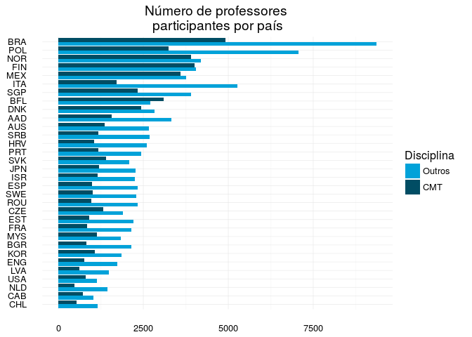
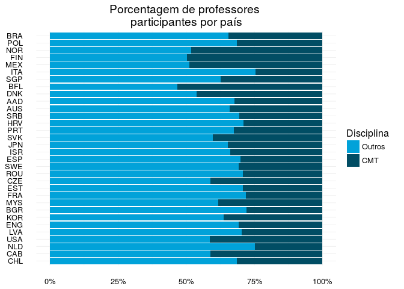
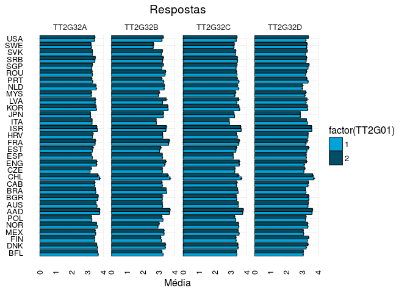

Primeiros passos em Talis 2013
================
André Rodrigues
2016-11-09

Primeiros passos
================

### Carregando bibliotecas

O primeiro passo é sempre carregar as bibliotecas que serão utilizadas ao longo do programa. Cada biblioteca é como uma caixa de ferramentas que deve nos ajudar em tarefas específicas como, por exemplo, *criar gráficos*, *manipular de dados*, etc. Geralmente, procuro descrever como comentário o que cada biblioteca ajuda a realizar.

``` r
library(tidyr) # organização das informações
library(dplyr) # cria sumário e manipula dados
```

    ## 
    ## Attaching package: 'dplyr'

    ## The following objects are masked from 'package:stats':
    ## 
    ##     filter, lag

    ## The following objects are masked from 'package:base':
    ## 
    ##     intersect, setdiff, setequal, union

``` r
library(ggplot2) # criação de gráficos
library(ggthemes) # temas e cores para gráficos
library(plotly) # gráficos interativos
```

    ## 
    ## Attaching package: 'plotly'

    ## The following object is masked from 'package:ggplot2':
    ## 
    ##     last_plot

    ## The following object is masked from 'package:graphics':
    ## 
    ##     layout

``` r
library(descr) # tabelas cruzadas
library(knitr) # gera markdown
library(plotrix) # funções para gráficos
library(gtools) # ferramenta para mostrar informação
```

### Carregando dados

O segundo passo é carregar as informações. Os dados da pesquisa **TALIS 2013** estão em arquivos com *valores separados por vírgula* `.csv` \[Comma-separated values\]. Esse é atualmente o modo mais simples e versátil de guardar as informações, já que podem ser facilmente abertos em planilhas do *excel* ou softwares similares. Para abrir arquivos como esse utilizaremos a função `read.csv()`. Os dados estão separados em três arquivos, cada um identificado com a primeira letra representando os níveis de ensino:

> > **A:** fundamental I; **B:** começo do fundamental II; **C:** final do fundamental II.

Além disso, incluímos a variável `LEVEL` com as respectivas letras para que possamos manter a identificação ao unificarmos os dados.

``` r
# Carrega dados ref. a educação primária - arquivo iniciado com letra A
talis_atgintt2 <- read.csv("/home/andre/dados/talis/2013/ATGINTT2.csv")
talis_atgintt2$LEVEL <- "A"

# Carrega dados ref. ao ensino fundamental I - arquivo iniciado com letra B
talis_btgintt2 <- read.csv("/home/andre/dados/talis/2013/BTGINTT2.csv")
talis_btgintt2$LEVEL <- "B"

# Carrega dados ref. ao ensino fundamental I - arquivo iniciado com letra C
talis_ctgintt2 <- read.csv("/home/andre/dados/talis/2013/CTGINTT2.csv")
talis_ctgintt2$LEVEL <- "C"
```

Como as três planilhas (*data.farme*) têm o mesmo conjunto de variáveis/colunas podemos apenas emplilha-las utilizando a função `rbind()` que agrupa as linhas.

``` r
# Agrupa todos os dados em um único data frame talis13
talis13 <- rbind(talis_atgintt2,talis_btgintt2, talis_ctgintt2)
```

Com isso temos um conjunto de dados amplo e unificado. Com a função `dim()` conseguimos identificar o tamanho do *data frame*. E com a função `str()` conseguimos saber a estrutura da informação que está disponível.

``` r
str(talis13)
```

    ## 'data.frame':    142998 obs. of  527 variables:
    ##  $ IDSCHOOL    : int  1001 1001 1001 1001 1001 1001 1001 1001 1001 1001 ...
    ##  $ IDTEACH     : int  100101 100103 100104 100105 100107 100108 100110 100112 100113 100114 ...
    ##  $ CNTRY       : Factor w/ 32 levels "BFL","DNK","FIN",..: 1 1 1 1 1 1 1 1 1 1 ...
    ##  $ IDCNTRY     : int  956 956 956 956 956 956 956 956 956 956 ...
    ##  $ IDCNTRYR    : int  33 33 33 33 33 33 33 33 33 33 ...
    ##  $ IDCNTPOP    : Factor w/ 47 levels "BFL1","DNK1",..: 1 1 1 1 1 1 1 1 1 1 ...
    ##  $ PISASCHOOLID: int  99998 99998 99998 99998 99998 99998 99998 99998 99998 99998 ...
    ##  $ TT2G01      : int  2 1 2 1 1 2 1 1 1 1 ...
    ##  $ TT2G02      : int  35 48 36 45 52 28 42 26 35 29 ...
    ##  $ TT2G03      : int  1 1 1 1 1 1 1 1 3 1 ...
    ##  $ TT2G04      : int  6 6 6 6 6 6 6 6 1 6 ...
    ##  $ TT2G05A     : int  12 1 11 23 26 1 19 4 12 8 ...
    ##  $ TT2G05B     : int  12 21 11 24 29 4 22 4 12 8 ...
    ##  $ TT2G05C     : int  0 0 0 0 3 2 0 0 0 0 ...
    ##  $ TT2G05D     : int  0 7 2 0 99 0 0 0 0 0 ...
    ##  $ TT2G06      : int  1 1 1 1 1 3 1 1 1 1 ...
    ##  $ TT2G07      : int  2 2 2 2 2 2 2 2 2 2 ...
    ##  $ TT2G08      : int  96 96 96 96 96 96 96 96 96 96 ...
    ##  $ TT2G09      : int  2 3 2 3 2 1 2 2 2 2 ...
    ##  $ TT2G10      : int  2 2 2 3 2 2 2 2 2 2 ...
    ##  $ TT2G11      : int  1 1 1 1 1 1 1 1 1 1 ...
    ##  $ TT2G12A     : int  1 1 1 1 1 2 1 1 1 1 ...
    ##  $ TT2G12B     : int  1 1 1 1 1 2 1 1 1 1 ...
    ##  $ TT2G12C     : int  1 1 1 1 2 2 1 1 1 1 ...
    ##  $ TT2G13A     : int  3 3 4 3 4 2 3 3 4 3 ...
    ##  $ TT2G13B     : int  3 2 4 3 4 3 3 3 3 3 ...
    ##  $ TT2G13C     : int  3 2 4 3 3 3 3 3 4 2 ...
    ##  $ TT2G14A1    : int  1 1 2 1 1 1 1 1 1 1 ...
    ##  $ TT2G14A2    : int  2 2 2 2 2 2 2 2 2 2 ...
    ##  $ TT2G14A3    : int  8 8 8 8 8 8 8 8 8 8 ...
    ##  $ TT2G14A4    : int  2 2 2 2 2 2 2 2 2 2 ...
    ##  $ TT2G14B1    : int  1 1 2 1 1 1 1 1 1 1 ...
    ##  $ TT2G14B2    : int  2 2 2 2 2 2 2 2 2 2 ...
    ##  $ TT2G14B3    : int  8 8 8 8 8 8 8 8 8 8 ...
    ##  $ TT2G14B4    : int  2 2 2 2 2 2 2 2 2 2 ...
    ##  $ TT2G14C1    : int  1 1 2 1 1 1 1 2 1 1 ...
    ##  $ TT2G14C2    : int  2 2 2 2 2 2 2 2 2 2 ...
    ##  $ TT2G14C3    : int  8 8 8 8 8 8 8 8 8 8 ...
    ##  $ TT2G14C4    : int  2 2 2 2 2 2 2 1 2 2 ...
    ##  $ TT2G14D1    : int  1 1 2 2 1 2 1 1 1 1 ...
    ##  $ TT2G14D2    : int  2 2 2 2 2 2 2 2 2 2 ...
    ##  $ TT2G14D3    : int  8 8 8 8 8 8 8 8 8 8 ...
    ##  $ TT2G14D4    : int  2 2 2 2 2 2 2 1 2 2 ...
    ##  $ TT2G14E1    : int  1 1 2 1 1 2 1 1 1 2 ...
    ##  $ TT2G14E2    : int  2 2 2 2 2 2 2 2 2 2 ...
    ##  $ TT2G14E3    : int  8 8 8 8 8 8 8 8 8 8 ...
    ##  $ TT2G14E4    : int  2 2 2 2 2 2 2 1 2 2 ...
    ##  $ TT2G14F1    : int  1 2 2 2 2 2 2 2 2 2 ...
    ##  $ TT2G14F2    : int  2 2 2 2 2 2 2 2 2 2 ...
    ##  $ TT2G14F3    : int  8 8 8 8 8 8 8 8 8 8 ...
    ##  $ TT2G14F4    : int  2 2 2 2 2 2 2 2 2 2 ...
    ##  $ TT2G14G1    : int  1 2 2 2 2 1 1 1 1 2 ...
    ##  $ TT2G14G2    : int  2 2 2 2 2 2 2 2 2 2 ...
    ##  $ TT2G14G3    : int  8 8 8 8 8 8 8 8 8 8 ...
    ##  $ TT2G14G4    : int  2 2 2 2 2 2 1 1 2 2 ...
    ##  $ TT2G14H1    : int  1 1 2 2 1 1 1 1 1 1 ...
    ##  $ TT2G14H2    : int  2 2 2 2 2 2 2 2 2 2 ...
    ##  $ TT2G14H3    : int  8 8 8 8 8 8 8 8 8 8 ...
    ##  $ TT2G14H4    : int  2 2 2 2 2 2 2 2 2 2 ...
    ##  $ TT2G14I1    : int  1 1 1 1 1 1 1 1 1 1 ...
    ##  $ TT2G14I2    : int  2 2 2 2 2 2 2 2 2 2 ...
    ##  $ TT2G14I3    : int  8 8 8 8 8 8 8 8 8 8 ...
    ##  $ TT2G14I4    : int  2 2 2 2 2 2 2 2 2 2 ...
    ##  $ TT2G14J1    : int  1 1 1 2 1 1 1 1 1 1 ...
    ##  $ TT2G14J2    : int  2 2 2 2 2 2 2 2 2 2 ...
    ##  $ TT2G14J3    : int  8 8 8 8 8 8 8 8 8 8 ...
    ##  $ TT2G14J4    : int  2 2 2 2 2 2 2 2 2 2 ...
    ##  $ TT2G14K1    : int  2 1 2 2 1 2 2 2 1 1 ...
    ##  $ TT2G14K2    : int  2 2 2 2 2 2 2 2 2 2 ...
    ##  $ TT2G14K3    : int  8 8 8 8 8 8 8 8 8 8 ...
    ##  $ TT2G14K4    : int  2 2 2 2 2 2 2 2 2 2 ...
    ##  $ TT2G14L1    : int  1 1 2 1 1 1 1 1 1 1 ...
    ##  $ TT2G14L2    : int  2 2 2 2 2 2 2 2 2 2 ...
    ##  $ TT2G14L3    : int  8 8 8 8 8 8 8 8 8 8 ...
    ##  $ TT2G14L4    : int  2 2 2 2 2 2 2 1 2 2 ...
    ##  $ TT2G14M1    : int  2 2 2 2 2 2 2 2 2 2 ...
    ##  $ TT2G14M2    : int  2 2 2 2 2 2 2 2 2 2 ...
    ##  $ TT2G14M3    : int  8 8 8 8 8 8 8 8 8 8 ...
    ##  $ TT2G14M4    : int  2 2 2 2 2 2 2 2 2 2 ...
    ##  $ TT2G14MT    : Factor w/ 8307 levels " ","0","1/2 \xe5r skolebibliotekkunnskap",..: 1 1 1 1 1 1 1 1 1 1 ...
    ##  $ TT2G15A     : int  1 1 2 1 1 2 1 1 1 1 ...
    ##  $ TT2G15B     : int  1 1 2 1 1 2 1 1 1 1 ...
    ##  $ TT2G15C     : int  8 8 8 8 8 8 8 8 8 8 ...
    ##  $ TT2G15D     : int  8 8 8 8 8 8 8 8 8 8 ...
    ##  $ TT2G15E     : int  2 1 2 1 1 2 1 1 2 2 ...
    ##  $ TT2G15F     : int  8 8 8 8 8 8 8 8 8 8 ...
    ##  $ TT2G15G     : int  8 8 8 8 8 8 8 8 8 8 ...
    ##  $ TT2G15H     : int  1 1 2 1 1 2 1 1 1 1 ...
    ##  $ TT2G15I     : int  2 2 1 2 2 2 2 2 1 2 ...
    ##  $ TT2G15J     : int  2 2 2 2 2 1 2 2 2 2 ...
    ##  $ TT2G15K     : int  8 8 8 8 8 8 8 8 8 8 ...
    ##  $ TT2G15L     : int  1 2 2 1 1 2 2 2 1 2 ...
    ##  $ TT2G16      : int  45 36 14 40 40 32 32 43 20 56 ...
    ##  $ TT2G17      : int  24 26 13 24 24 27 20 24 12 24 ...
    ##  $ TT2G18A     : int  6 1 1 8 8 3 2 12 2 4 ...
    ##  $ TT2G18B     : int  3 4 3 5 4 2 2 2 2 1 ...
    ##  $ TT2G18C     : int  2 2 0 2 6 0 7 3 1 1 ...
    ##  $ TT2G18D     : int  2 1 0 1 2 0 0 0 1 0 ...
    ##  $ TT2G18E     : int  1 0 0 1 2 0 0 0 999 0 ...
    ##   [list output truncated]

Com a função `head()` podemos imprimir na tela as primeiras linhas do nosso *data frame*. Com a função `tail()` podemos imprimir na tela as últimas linhas do nosso *data frame*.

Informações sobre a amostra
===========================

### Tabela 1 - sumário inicial

Para iniciar a investigação é importante criar uma breve descrição das informações. Neste caso podemos apresentar uma table com o *número de observações* por *país* `CNTRY`.

Na tabela abaixo mostra a lista com os países participantes no TALIS 2013.

``` r
# Cria sumário
s01 <- talis13 %>%
  group_by(CNTRY) %>%
  summarise(N=n()) %>%
  mutate(PROP=100*N/sum(N)) %>%
  arrange(desc(N))

# Apresenta tabela

 kable(s01, col.names=c("País", "N", "Prop(%)"),
        caption = "Lista de Países participantes",
        digits=2)
```

| País |      N|  Prop(%)|
|:-----|------:|--------:|
| BRA  |  14291|     9.99|
| POL  |  10298|     7.20|
| NOR  |   8089|     5.66|
| FIN  |   8073|     5.65|
| MEX  |   7369|     5.15|
| ITA  |   6996|     4.89|
| SGP  |   6240|     4.36|
| BFL  |   5810|     4.06|
| DNK  |   5251|     3.67|
| AAD  |   4905|     3.43|
| AUS  |   4041|     2.83|
| SRB  |   3857|     2.70|
| HRV  |   3675|     2.57|
| PRT  |   3628|     2.54|
| SVK  |   3493|     2.44|
| JPN  |   3484|     2.44|
| ISR  |   3403|     2.38|
| ESP  |   3339|     2.33|
| SWE  |   3319|     2.32|
| ROU  |   3286|     2.30|
| CZE  |   3219|     2.25|
| EST  |   3129|     2.19|
| FRA  |   3002|     2.10|
| MYS  |   2984|     2.09|
| BGR  |   2975|     2.08|
| KOR  |   2933|     2.05|
| ENG  |   2496|     1.75|
| LVA  |   2126|     1.49|
| USA  |   1926|     1.35|
| NLD  |   1912|     1.34|
| CAB  |   1773|     1.24|
| CHL  |   1676|     1.17|

### Gráfico 1 - sumário inicial

``` r
g01 <- ggplot(s01, aes(x=reorder(factor(CNTRY), N), y=N, label=N)) +
  geom_bar(position = "dodge", stat="identity", fill=c("#014d64")) +
  geom_text(aes(label=N), color="white", hjust=1.2)+
  coord_flip() +
  theme_minimal() +
  scale_fill_economist()+
  labs(x=NULL, y=NULL, title="Número de professores \nparticipantes por país")
g01
```


-----------------------------------------------------

Organiza dados de interesse
===========================

### Prefessores de Ciências, Matemática ou Tecnologia

Selecionamos todos os professores que lecionaram as disciplinas de interesse (*Ciências, Matemática ou Tecnologia*) no ano anterior e destacamos dos demais professores. Representadas, respectivamente, pelas letras **B**, **C** e **G** ao fim das variáveis.

``` r
# separa aqueles que deram aula de ciências, matemática e tecnologia.
talis13 <- talis13 %>%
  mutate(CMT=ifelse(TT2G15B==1 | TT2G15C==1  ,1,0))
```

### Quem são os professores..

No gráfico a seguir podemos ver a distribuição por sexo por país.

``` r
s1 <- talis13 %>%
  group_by(CMT,CNTRY) %>%
  summarise(N=n())

g1 <- ggplot(s1, aes(x=reorder(factor(CNTRY), N), y=N, fill=factor(CMT))) +
  geom_bar(position = "dodge", stat="identity") +
  coord_flip() +
  theme_minimal()+
  labs(x=NULL, y=NULL, title="Número de professores \nparticipantes por país" )+
  scale_fill_economist(name="Disciplina", labels=c("Outros", "CMT"))
g1
```



``` r
g2 <- ggplot(s1, aes(x=reorder(factor(CNTRY), N), y=N, fill=factor(CMT))) +
  geom_bar(position = "fill", stat="identity") +
  coord_flip() +
  theme_minimal()+
  scale_fill_economist(name="Disciplina", labels=c("Outros", "CMT"))+
  labs(x=NULL, y=NULL, title="Porcentagem de professores \nparticipantes por país" )+
  scale_y_continuous(labels =scales::percent)
  
g2
```



Questão foco
============

Para aprofundar a discussão iremos focar nas quatro questões do item **32**. Esse item tenta avaliar a perspectiva pedagógica do professor frente a *investigação*, *autonomia do estudante* e a *importância dos conteúdos*. Como segue.

1.  We would like to ask about your personal beliefs on teaching and learning. Please indicate how strongly you agree or disagree with each of the following statements.

<!-- -->

1.  My role as a teacher is to facilitate students’ own inquiry. \[**TT2G32A**\]

2.  Students learn best by finding solutions to problems on their own. \[**TT2G32B** \]

3.  Students should be allowed to think of solutions to practical problems themselves before the teacher shows them how they are solved. \[**TT2G32C**\]

4.  Thinking and reasoning processes are more important than specific curriculum content. \[**TT2G32D**\]

### Descrição do item 32

No sumário abaxio podemos identificar as médias `mean`, erro padrão `errp`, desvio padrão `sd` e o número de observações `n`.

``` r
s1A <- talis13 %>%
  group_by(CNTRY, CMT) %>%
  filter(TT2G32A!=9,TT2G32B!=9,TT2G32C!=9,TT2G32D!=9,
         TT2G32A!=6,TT2G32B!=6,TT2G32C!=6,TT2G32D!=6) %>%
  summarise_each(funs(n(),mean,sd,errp=std.error(.)), TT2G32A:TT2G32D) %>%
  gather(key, value, TT2G32A_n:TT2G32D_errp) %>%
  separate(key,c("QUEST", "STAT")) %>%
  spread(STAT, value)
  

kable(head(sample_n(s1A, 1)))
```

| CNTRY |  CMT| QUEST   |       errp|      mean|     n|         sd|
|:------|----:|:--------|----------:|---------:|-----:|----------:|
| BFL   |    0| TT2G32B |  0.0165321|  3.165411|  2654|  0.8516817|
| DNK   |    1| TT2G32C |  0.0166265|  3.411666|  2383|  0.8116376|
| FIN   |    0| TT2G32D |  0.0147102|  3.308959|  4007|  0.9311694|
| MEX   |    1| TT2G32B |  0.0128023|  3.320462|  3548|  0.7625714|
| NOR   |    1| TT2G32B |  0.0192713|  2.778815|  3748|  1.1798095|
| POL   |    1| TT2G32A |  0.0106337|  3.244801|  3174|  0.5990825|

### Gráfico 3 examinando o item 32

No gráfico `g3` podemos comparar as médias de respostas dadas por professores de ciências e matemática para as questões A, B, C e D, respectivamente.

``` r
g3 <- ggplot(data=s1A, aes(y=mean, x=reorder(factor(CNTRY), mean), fill=factor(CMT))) +
  geom_bar(position=position_dodge(), stat="identity",
           colour="black", size=.3) +
  geom_errorbar(aes(ymin=mean-errp, ymax=mean+errp),
                size=.3, width=.2, position=position_dodge(.9)) +
  labs(x=NULL, y="Média" , title="Respostas") +
  scale_fill_economist(name="GRUPO", 
                       labels=c("Outros", "CMT"))+
  coord_flip() +
  theme_minimal() +
  theme(axis.text.x =element_text(angle=90, vjust =0.5))+
  facet_grid(.~QUEST)
g3
```


No gráfico anterior é difícil identicar as diferenças entre as barras e comprar as diferenças entre os países. Por essa razão fazemos o cálculo

``` r
s1dif <- s1A %>%
  select(CNTRY, CMT, QUEST, mean) %>%
  spread(CMT, mean, sep="_") %>%
  group_by(QUEST, CNTRY) %>%
  mutate(diff=CMT_0-CMT_1, col=ifelse(diff<0, 0, 1))

head(s1dif)
```

    ## Source: local data frame [6 x 6]
    ## Groups: QUEST, CNTRY [6]
    ## 
    ##    CNTRY   QUEST    CMT_0    CMT_1        diff   col
    ##   <fctr>   <chr>    <dbl>    <dbl>       <dbl> <dbl>
    ## 1    BFL TT2G32A 3.638282 3.654563 -0.01628146     0
    ## 2    BFL TT2G32B 3.165411 3.220805 -0.05539401     0
    ## 3    BFL TT2G32C 3.305576 3.360157 -0.05458053     0
    ## 4    BFL TT2G32D 2.971741 3.018319 -0.04657784     0
    ## 5    DNK TT2G32A 3.607443 3.541334  0.06610809     1
    ## 6    DNK TT2G32B 3.377235 3.362149  0.01508603     1

### Gráfico

``` r
g4 <- ggplot(data=s1dif, aes(y=diff, x=reorder(factor(CNTRY), diff), fill=factor(col))) +
  geom_bar(position="dodge", stat="identity") +
  labs(x=NULL, y="Média" , title="Respostas") +
  scale_fill_wsj()+
  coord_flip() +
  theme_minimal() +
  theme(axis.text.x =element_text(angle=90, vjust =0.5))+
  facet_grid(.~QUEST)

g4
```


Além de saber a diferença devemos testar para saber se essa diferença é ou não significante. Para isso utilizaremos um teste t que compara o grupo CMT (*professores de ciências e matemática*) com os demais (*outros*) dentro de cada país.

``` r
ttest <- talis13 %>%
  group_by( CNTRY) %>%
  select(CNTRY, CMT,TT2G32A:TT2G32D) %>%
  filter(TT2G32A!=9,TT2G32B!=9,TT2G32C!=9,TT2G32D!=9,
         TT2G32A!=6,TT2G32B!=6,TT2G32C!=6,TT2G32D!=6) %>%
  summarise_each(funs(t.test(.[CMT == 0], .[CMT == 1])$p.value),vars=TT2G32A:TT2G32D)

head(ttest)
```

    ## # A tibble: 6 × 5
    ##    CNTRY        vars1        vars2        vars3        vars4
    ##   <fctr>        <dbl>        <dbl>        <dbl>        <dbl>
    ## 1    BFL 3.657679e-01 8.238421e-03 5.373144e-03 3.874554e-02
    ## 2    DNK 4.462305e-03 5.450373e-01 3.170854e-01 7.414587e-01
    ## 3    FIN 1.239472e-05 8.230312e-06 5.507443e-01 2.884922e-01
    ## 4    MEX 6.556344e-01 1.595706e-03 1.700010e-03 8.808685e-01
    ## 5    NOR 1.968949e-08 1.120931e-06 2.558205e-01 1.603681e-06
    ## 6    POL 7.301350e-04 5.128220e-10 1.553034e-16 4.647835e-04

### Gráfico do item 32 questão **A**

Para olharmos com mais detalhes para a questão A, o gráfico a seguir mostra as diferenças com os respectivos níveis de significancia. O mesmo é feito para as questões B, C e D.

``` r
gdifa <- s1dif %>%
  filter(QUEST=="TT2G32A") %>%
  left_join(., ttest, by="CNTRY") %>%
  mutate(pv=stars.pval(vars1)) %>%
  ggplot(aes(y=diff, x=reorder(factor(CNTRY), diff), fill=factor(col))) +
  geom_bar(position="dodge", stat="identity") +
  geom_text(aes(x=factor(CNTRY), y=diff, label=pv, hjust=ifelse(diff>0,1.5,-0.2)), 
            vjust=0.7, col="white" )+
  annotate("text", label= "*** p<0,001 \n** p<0,01 \n* p<0,05", x=3.5, y=0.23)+
  labs(x=NULL, y="Diferença" , title="Diferença na média das respostas \nquestão A")+
  scale_fill_wsj()+
  coord_flip() +
  theme_minimal() +
  theme(axis.text.x =element_text(angle=90, vjust =0.5), 
        legend.position = "none")
gdifa
```


``` r
gdifa <- s1dif %>%
  filter(QUEST=="TT2G32B") %>%
  left_join(., ttest, by="CNTRY") %>%
  mutate(pv=stars.pval(vars2)) %>%
  ggplot(aes(y=diff, x=reorder(factor(CNTRY), diff), fill=factor(col))) +
  geom_bar(position="dodge", stat="identity") +
  geom_text(aes(x=factor(CNTRY), y=diff, label=pv, hjust=ifelse(diff>0,1.5,-0.2)), 
            vjust=0.7, col="white")+
  annotate("text", label= "*** p<0,001 \n** p<0,01 \n* p<0,05", x=3.5, y=0.23)+
  labs(x=NULL, y="Diferença" , title="Diferença na média das respostas \nquestão B")+
  scale_fill_wsj()+
  coord_flip() +
  theme_minimal() +
  theme(axis.text.x =element_text(angle=90, vjust =0.5), 
        legend.position = "none")
gdifa
```


``` r
gdifa <- s1dif %>%
  filter(QUEST=="TT2G32C") %>%
  left_join(., ttest, by="CNTRY") %>%
  mutate(pv=stars.pval(vars3)) %>%
  ggplot(aes(y=diff, x=reorder(factor(CNTRY), diff), fill=factor(col))) +
  geom_bar(position="dodge", stat="identity") +
  geom_text(aes(x=factor(CNTRY), y=diff, label=pv, hjust=ifelse(diff>0,1.5,-0.2)), 
            vjust=0.7, col="white" )+
  annotate("text", label= "*** p<0,001 \n** p<0,01 \n* p<0,05", x=3.5, y=0.23)+
  labs(x=NULL, y="Diferença" , title="Diferença na média das respostas \nquestão C")+
  scale_fill_wsj()+
  coord_flip() +
  theme_minimal() +
  theme(axis.text.x =element_text(angle=90, vjust =0.5), 
        legend.position = "none")
gdifa
```


``` r
gdifa <- s1dif %>%
  filter(QUEST=="TT2G32D") %>%
  left_join(., ttest, by="CNTRY") %>%
  mutate(pv=stars.pval(vars4)) %>%
  ggplot(aes(y=diff, x=reorder(factor(CNTRY), diff), fill=factor(col))) +
  geom_bar(position="dodge", stat="identity") +
  geom_text(aes(x=factor(CNTRY), y=diff, label=pv, hjust=ifelse(diff>0,1.5,-0.2)), 
            vjust=0.7, col="white" )+
  annotate("text", label= "*** p<0,001 \n** p<0,01 \n* p<0,05", x=3.5, y=0.23)+
  labs(x=NULL, y="Diferença" , title="Diferença na média das respostas \nquestão D")+
  scale_fill_wsj()+
  coord_flip() +
  theme_minimal() +
  theme(axis.text.x =element_text(angle=90, vjust =0.5), 
        legend.position = "none")
gdifa
```


Outras anotações e separação por gênero
=======================================

``` r
s1gend <- talis13 %>%
  group_by(CNTRY, TT2G01) %>%
  filter(TT2G01!=9) %>%
  summarise_each(funs(n(),mean,sd,errp=std.error(.)), TT2G32A:TT2G32D) %>%
  gather(key, value, TT2G32A_n:TT2G32D_errp) %>%
  separate(key,c("QUEST", "STAT")) %>%
  spread(STAT, value)
  

kable(head(sample_n(s1gend, 1)))
```

| CNTRY |  TT2G01| QUEST   |       errp|      mean|     n|         sd|
|:------|-------:|:--------|----------:|---------:|-----:|----------:|
| BFL   |       1| TT2G32D |  0.0160115|  3.065875|  4296|  1.0494588|
| DNK   |       1| TT2G32C |  0.0174165|  3.473043|  3283|  0.9979205|
| FIN   |       1| TT2G32D |  0.0126046|  3.317795|  5878|  0.9663699|
| MEX   |       1| TT2G32D |  0.0163793|  3.085722|  3908|  1.0239371|
| NOR   |       1| TT2G32D |  0.0221215|  3.356050|  5165|  1.5898243|
| POL   |       1| TT2G32A |  0.0094980|  3.284768|  7852|  0.8416355|

``` r
g4 <- ggplot(data=s1gend, aes(y=mean, x=CNTRY, fill=factor(TT2G01))) +
  geom_bar(position=position_dodge(), stat="identity",
           colour="black", size=.3) +
  geom_errorbar(aes(ymin=mean-errp, ymax=mean+errp),
                size=.3, width=.2, position=position_dodge(.9)) +
  labs(x=NULL, y="Média" , title="Respostas") +
  scale_fill_economist()+
  coord_flip() +
  theme_minimal() +
  theme(axis.text.x =element_text(angle=90, vjust =0.5))+
  facet_grid(.~QUEST)
g4
```


